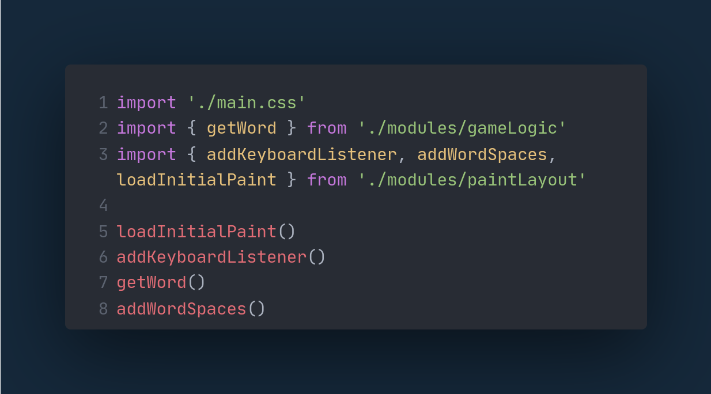
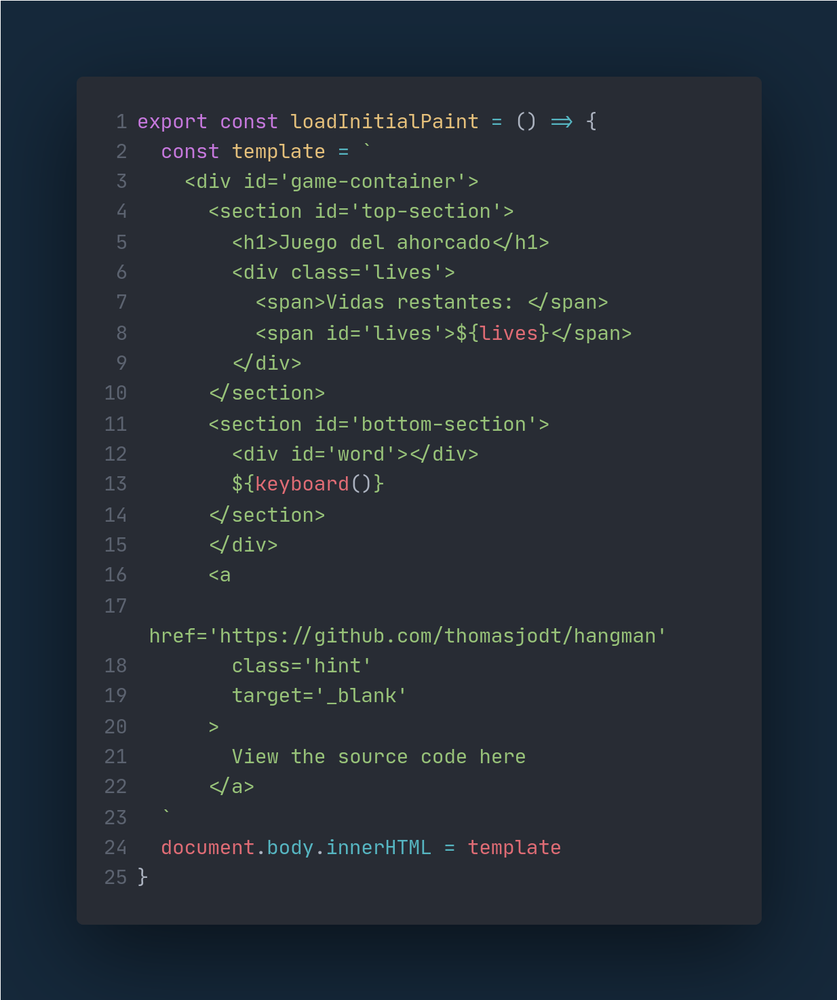
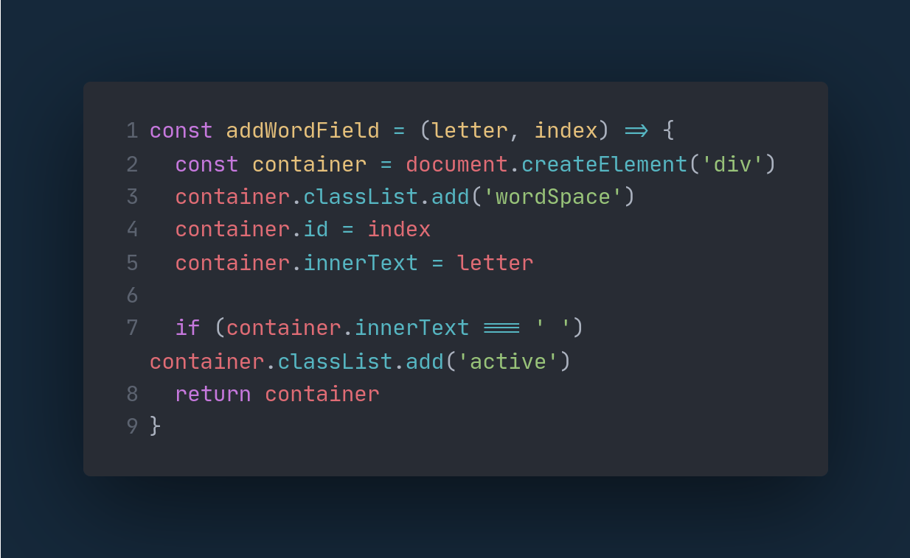
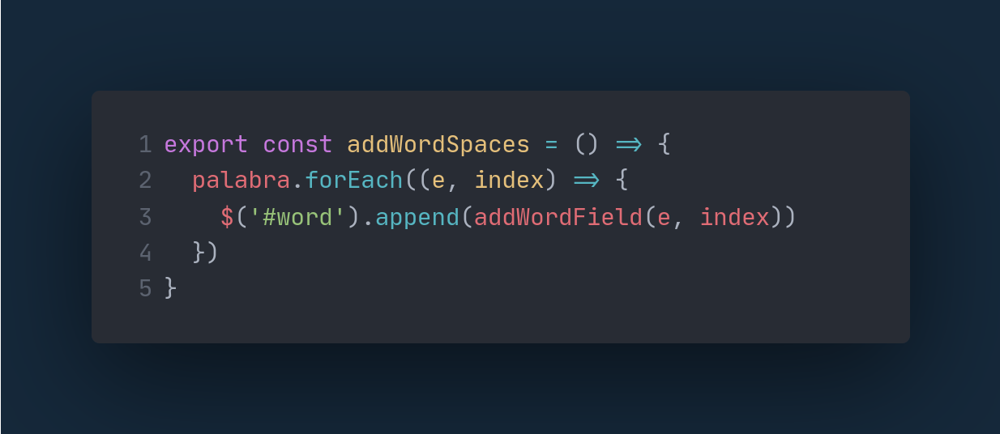
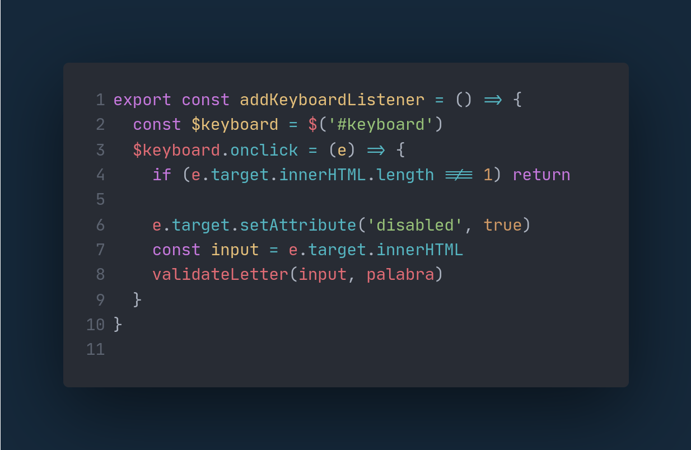

# Juego del Ahorcado
Trabajo final para el curso de Desarrollo Web Fullstack.

Este proyecto está trabajado enteramente con JavaScript.

### La estructura del proyecto es la siguiente:
```
src
|-modules
| |-data.js
| |-gameLogic.js
| |-keyboard.js
| |-paintLayout.js
|-main.js
```
- El archivo `main.js` contiene las funciones para cargar el renderizado inicial, estilos y conecta todos los demás módulos para que el juego funcione.

- `data.js` contiene un arreglo lleno de palabras que se escojerán aleatoriamente para que el juego pueda funcionar.

- `gameLogic.js` contiene toda la lógica del juego, es uno de los archivos más importantes.

- `keyboard.js` solamente contiene la función para generar el teclado.

- `paintLayout.js` es otro de los más importantes y contiene las funciones para el  renderizado principal que se cargan en el archivo `main.js`.

# `main`


# `paintLayout`
## `loadInitialPaint`
El siguiente es la función que genera los bloques de código que se añadirán dentro del `body` del documento.
Dentro de su estructura se puede observar que se usa la variable `lives` para mostrar la cantidad de vidas que uno tiene al iniciar el juego y más abajo de observa el llamado a la función `keyboard` que generará el teclado para poder jugar.


## `AddWordField`
El siguiente es la función que crea los cuadros donde van a ir las letras de la palabra, les agrega una clase para darle estilos, un id que servirá para que la letra sea visible y el contenido.
Si es una palabra compuesta y la letra es un espacio, se le agregará adelantadamente la clase `active` para evitar tener que agregar los espacios a la hora de ejecución.


## `addWordSpaces`
El siguiente es el complemento de la función anterior, esta analiza la palabra secreta y adjunta dentro del contenedor de la palabra un campo para cada letra


## `addKeyboardListener`
Esta es la última función de este archivo y agrega un escuchador de eventos al teclado para escuchar cuando se hace clic en alguno de sus botones.
Lo primero que hace es agregar el atributo de `disabled` a cada botón aplastado para que este no se vuelva a aplastar y muestre que ya ha sido utilizado y utiliza la función `validateLetter` perteneciente al archivo de la lógica del juego.
